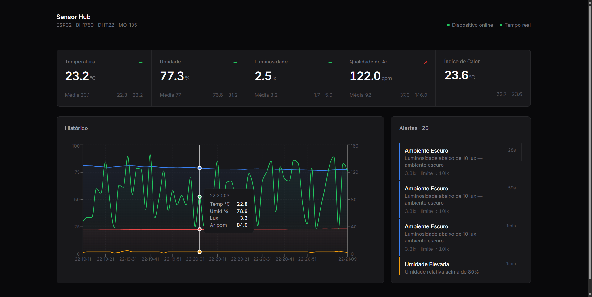
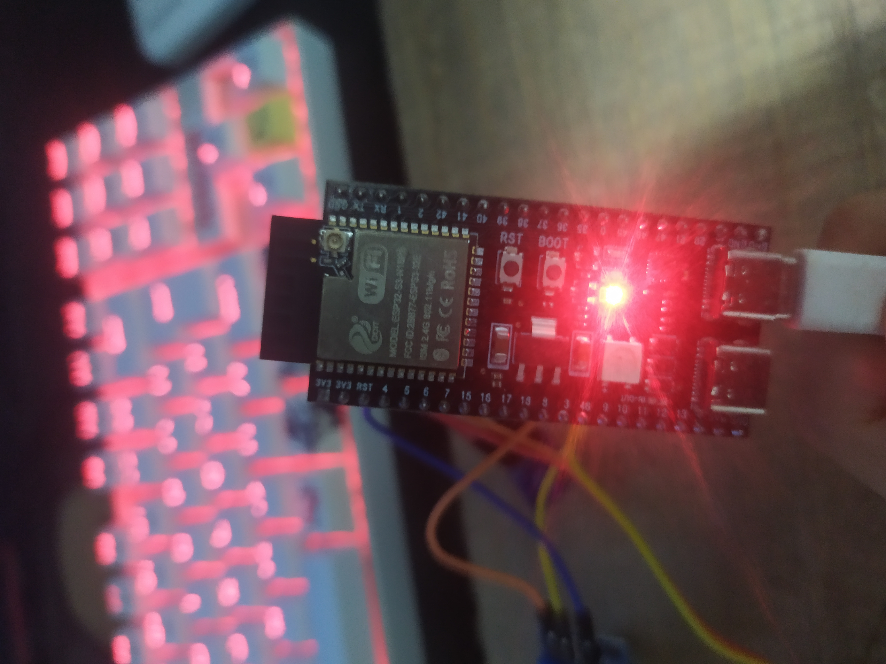
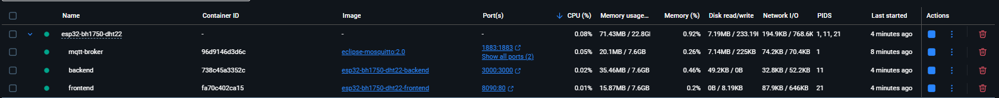

<div align="center">

# 🌡️ ESP32 Sensor Hub — Monitoramento Ambiental em Tempo Real

### Projeto Integrador — UNIVESP (Universidade Virtual do Estado de São Paulo)

[](https://univesp.br)
[]()
[]()
[]()
[]()

</div>

---

Sistema IoT completo para **monitoramento ambiental** com sensores de temperatura, umidade, luminosidade e qualidade do ar. Dados coletados por um **ESP32-S3** são transmitidos via **MQTT** para um backend **NestJS**, que os repassa em tempo real por **WebSocket** a um dashboard **React**.

<div align="center">



_Dashboard em tempo real exibindo telemetria dos sensores com gráfico histórico e painel de alertas._

</div>

---

## 📐 Arquitetura

```
┌──────────────┐        MQTT         ┌──────────────┐      WebSocket      ┌──────────────┐
│   ESP32-S3   │ ──────────────────► │  Mosquitto   │ ◄──────────────────► │   NestJS     │
│  BH1750      │   esp32/sensors/*   │  (Broker)    │                      │  (Backend)   │
│  DHT22       │                     │  :1883       │                      │  :3000       │
│  MQ-135      │                     └──────────────┘                      └──────┬───────┘
└──────────────┘                                                                  │
                                                                           Socket.IO
                                                                                  │
                                                                           ┌──────▼───────┐
                                                                           │    React     │
                                                                           │  (Frontend)  │
                                                                           │  :8080       │
                                                                           └──────────────┘
```

---

## 🔩 Hardware

### Board

| Campo      | Valor                                      |
| ---------- | ------------------------------------------ |
| Módulo     | 4D Systems GEN4-ESP32 16MB (ESP32S3-R8N16) |
| MCU        | ESP32-S3                                   |
| Flash      | 16 MB (QIO)                                |
| PSRAM      | 8 MB (OPI)                                 |
| USB Serial | UART via CH340/CP210x — **COM8**           |

### Sensores

#### BH1750 — Luminosidade (I2C)

| Pino BH1750 | GPIO ESP32-S3 | Observação                |
| ----------- | ------------- | ------------------------- |
| VCC         | 3.3 V         | **Não usar 5 V**          |
| GND         | GND           |                           |
| SCL         | GPIO 18       | Pull-up 4.7 kΩ para 3.3 V |
| SDA         | GPIO 17       | Pull-up 4.7 kΩ para 3.3 V |
| ADDR        | GND           | Endereço I2C: `0x23`      |

> Se o pino **ADDR** estiver ligado ao **VCC**, o endereço passa a ser `0x5C`. O firmware tenta os dois automaticamente.

#### DHT22 — Temperatura e Umidade

| Pino DHT22 | GPIO ESP32-S3 | Observação    |
| ---------- | ------------- | ------------- |
| VCC        | 3.3 V         |               |
| GND        | GND           |               |
| DATA       | GPIO 4        | Pull-up 10 kΩ |

#### MQ-135 — Qualidade do Ar (ADC)

| Pino MQ-135 | GPIO ESP32-S3 | Observação          |
| ----------- | ------------- | ------------------- |
| VCC         | 5 V           | Alimentação         |
| GND         | GND           |                     |
| AOUT        | GPIO 5        | Saída analógica ADC |

---

## 🚀 Como executar

### Pré-requisitos

- [Docker](https://www.docker.com/) e Docker Compose
- [PlatformIO](https://platformio.org/) (para o firmware)
- Rede Wi-Fi acessível pelo ESP32 e pela máquina host

### 1. Configurar o firmware

Copie o arquivo de exemplo e preencha suas credenciais:

```bash
cp iot-device/include/secrets.h.example iot-device/include/secrets.h
```

Edite `secrets.h` com o SSID/senha do Wi-Fi e o IP da máquina que roda o Docker:

```c
#define WIFI_SSID "SuaRede"
#define WIFI_PASS "SuaSenha"
#define MQTT_BROKER "192.168.x.x"   // IP da máquina host
```

### 2. Subir a infraestrutura

```bash
# Backend + Frontend + Broker MQTT (sem mock)
docker compose up -d mqtt-broker backend frontend

# Ou com simulador de telemetria (sem ESP32 físico)
docker compose up -d
```

### 3. Gravar o firmware no ESP32

```bash
cd iot-device

# Build
pio run

# Upload
pio run --target upload

# Monitor serial
pio device monitor
```

### 4. Acessar o dashboard

Abra no navegador: **http://127.0.0.1:8080**

---

## 🐳 Serviços Docker

| Serviço       | Porta Host | Porta Container | Descrição                          |
| ------------- | ---------- | --------------- | ---------------------------------- |
| `mqtt-broker` | 1883       | 1883            | Broker MQTT (Mosquitto)            |
| `mqtt-broker` | 9001       | 9001            | WebSocket do MQTT (debug)          |
| `backend`     | 3000       | 3000            | API REST + WebSocket (NestJS)      |
| `frontend`    | 8080       | 80              | Dashboard (React + nginx)          |
| `mock-device` | —          | —               | Simulador de telemetria (opcional) |

---

## 📡 Tópicos MQTT

| Tópico                       | Direção        | Descrição                               |
| ---------------------------- | -------------- | --------------------------------------- |
| `esp32/sensors/telemetry`    | ESP32 → Broker | JSON com todas as leituras dos sensores |
| `esp32/sensors/status`       | ESP32 → Broker | `online` / `offline` (retained)         |
| `esp32/sensors/set/interval` | Broker → ESP32 | Define novo intervalo de leitura (ms)   |

---

## 📁 Estrutura do projeto

```
├── docker-compose.yml          # Orquestração dos containers
├── backend/                    # NestJS — subscriber MQTT + API + WebSocket
│   └── src/
│       ├── mqtt/               # Serviço de conexão MQTT
│       ├── sensors/            # Controller, Gateway e Service de sensores
│       └── alerts/             # Regras e painel de alertas
├── frontend/                   # React + Vite — Dashboard em tempo real
│   ├── nginx.conf              # Proxy reverso para backend
│   └── src/
│       ├── components/         # Dashboard, SensorCard, SensorChart, AlertPanel
│       ├── hooks/              # useSocket (conexão Socket.IO)
│       └── types/              # Tipagem de telemetria
├── iot-device/                 # Firmware ESP32 (PlatformIO)
│   ├── platformio.ini
│   ├── include/secrets.h       # Credenciais (não versionado)
│   └── src/main.cpp            # Leitura dos sensores + publish MQTT
├── mock/                       # Simulador de telemetria MQTT
│   └── publish.js
└── mqtt/
    └── config/mosquitto.conf   # Configuração do Mosquitto
```

---

## 🛠️ Tecnologias

| Camada   | Stack                                               |
| -------- | --------------------------------------------------- |
| Firmware | C++ · Arduino Framework · PlatformIO · ESP32-S3     |
| Broker   | Eclipse Mosquitto 2.0                               |
| Backend  | NestJS · TypeScript · Socket.IO · MQTT.js           |
| Frontend | React 18 · TypeScript · Vite · Recharts · Socket.IO |
| Infra    | Docker · Docker Compose · nginx                     |

---

## 🔧 Solução de problemas

| Sintoma                                     | Causa provável                                | Solução                                                     |
| ------------------------------------------- | --------------------------------------------- | ----------------------------------------------------------- |
| Monitor não exibe nada após `psramInit`     | `ARDUINO_USB_CDC_ON_BOOT=1` (padrão do board) | Garantir `ARDUINO_USB_CDC_ON_BOOT=0` no `build_flags`       |
| `Nenhum dispositivo encontrado` no scan I2C | Fiação incorreta ou pull-ups ausentes         | Verificar SDA=17, SCL=18, VCC=3.3 V e resistores de pull-up |
| `NACK on transmit of address`               | Sensor não alimentado ou endereço errado      | Checar ADDR pin (GND → 0x23, VCC → 0x5C)                    |
| Dashboard retorna 400 no Chrome             | Chrome forçando HTTPS em `localhost`          | Acessar via `http://127.0.0.1:8080`                         |
| ESP32 não conecta ao MQTT                   | IP do broker incorreto em `secrets.h`         | Usar o IP da máquina host na rede local                     |

---

## 📷 Referências visuais

|          ESP32-S3          |            BH1750            |           DHT22            |           MQ-135            |
| :------------------------: | :--------------------------: | :------------------------: | :-------------------------: |
|  |  |  |  |



---

## 📄 Licença

Projeto acadêmico desenvolvido como parte do **Projeto Integrador** do curso de **Engenharia da Computação** da **UNIVESP** — Universidade Virtual do Estado de São Paulo.
